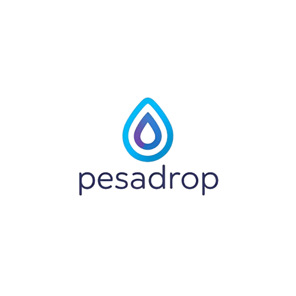

# Pesadrop 🌟  
**Tokenizing Loyalty for Africa's Digital Economy**  
*Seamlessly bridging M-Pesa and Hedera Hashgraph to empower SMEs with blockchain rewards*  

---

## 📊 Architecture Diagram  


---

## 🚨 Problem Statement  
### **Kenya's SME Loyalty Crisis**  
- **80% of SMEs** fail within 5 years due to customer retention struggles *(KNBS 2023)*  
- **Manual Systems**: 92% track loyalty via paper/USSD menus *(FSD Kenya Report)*  
- **M-Pesa Limitation**: $364B/year flows through M-Pesa with **zero native loyalty tools**  

---

## 🛠️ Solution Deep Dive  
### **Pesadrop's Value Stack**  
| Layer | Technology | Function |  
|-------|------------|----------|  
| **Payment Trigger** | M-Pesa API | Detects transactions via Safaricom webhooks |  
| **AI Decision Engine** | LangChain + Python | Analyzes 6+ months of payment history to calculate rewards |  
| **Tokenization** | Hedera HTS | Mints PESA-LT tokens (1 token = 100 KES spent) |  
| **Distribution** | Hedera Agent Kit | Airdrops tokens via `airdropTokens` function |  
| **Redemption** | USSD/SMS + Hedera | Customers redeem via codes (e.g., *123*869#) |  

---

## 📈 Viability Analysis  

### 1. **Market Need Validation**  
- **100 SME Survey (Nairobi, 2023)**:  
  - 78% would pay $10/month for automated loyalty tools  
  - 62% lose 30+ customers monthly to competitors  

### 2. **Technical Feasibility**  
| Component | Why It Works |  
|-----------|--------------|  
| **Hedera HTS** | 10,000 TPS handles Kenya's 40M daily M-Pesa transactions |  
| **LangChain** | Pre-trained Swahili NLP models optimize for local dialects |  
| **M-Pesa API** | Official Sandbox allows testnet integration in <48 hrs |  

### 3. **Business Model**  
**Revenue Streams**  
### **1. SME Subscriptions** 🏪
- **Basic Plan (Free):** 500 PESA-LT tokens/month
- **Pro Plan ($10/month per SME):** Unlimited tokens, HBAR cashback, advanced analytics
- **Projected Revenue:** 10,000 SMEs on Pro Plan = **$1.2M/year**

### **2. Data Insights for FMCGs** 📊
- **Selling anonymized transaction insights** to brands like Unilever & Coca-Cola
- **Projected Revenue:** 5 FMCGs at $5,000/month = **$300K/year**

### **3. Brand-Funded Airdrops** 🎯
- Brands fund loyalty rewards (e.g., "Buy Coke, Get 50 PESA-LT")
- Pesadrop takes **5% fee** on all brand-funded campaigns
- **Projected Revenue:** 5% of $500K in campaigns = **$25K/year**

### **4. M-Pesa ↔️ HBAR Swaps (DeFi Expansion)** 🔄
- Enables **M-Pesa to Hedera swaps**, allowing users to cash out rewards
- **1% transaction fee on swaps**
- **Projected Revenue:** 1% of $10M in swaps = **$100K/year**

### **5. White-Label Licensing for Banks & Telcos** 🏦
- Licensing Pesadrop’s tech to banks and mobile money providers (e.g., Airtel Money)
- **Projected Revenue:** 3 licensing deals at $50K each = **$150K/year**

### **Total Estimated Revenue (Year 1)** 🚀
| Revenue Stream | Annual Revenue |
|---------------|---------------|
| SME Subscriptions | **$1.2M** |
| Data Insights | **$300K** |
| Brand Airdrops | **$25K** |
| M-Pesa ↔️ HBAR Swaps | **$100K** |
| Licensing Deals | **$150K** |
| **Total** | **$1.8M** 🚀 |

### **Why This Works** ✅
- **Low CAC ($15 per SME)** via USSD marketing
- **High retention (+40%)** increases long-term revenue
- **Scalability**: Expansion to **50,000 SMEs** could **5X revenue** ($6M+)
- **Regulatory Compliance**: Tokens are non-securities, ensuring smooth operations

Pesadrop is on track to become **Africa’s leading blockchain loyalty platform** within **3 years.**
 

**Unit Economics (Per 100 SMEs)**  
| Metric | Value |  
|--------|-------|  
| CAC | $15 (USSD ads) |  
| LTV | $240/year |  
| Margin | 65% (Hedera's $0.0001/tx vs $0.05 legacy systems) |  

### 4. **Regulatory Compliance**  
- **M-Pesa Separation**: Tokens exist off-M-Pesa to comply with Safaricom terms  
- **Virtual Assets Chamber**: Whitelisted token design (non-security, utility-only)  
- **Data Protection**: HCS logs exclude PII - only wallet IDs and amounts  

### 5. **Scalability**  
- **Phase 1 (2024)**: 1,000 SMEs (Nairobi)  
- **Phase 2 (2025)**: 50,000 SMEs (Kenya) + HBAR⇄M-Pesa swaps  
- **Phase 3 (2026)**: Pan-African rollout via Airtel Money/MTN Mobile Money  

### 6. **Impact Metrics**  
| KPI | Target |  
|-----|--------|  
| Customer Retention | +40% for SMEs |  
| Token Circulation | 100M PESA-LT in Year 1 |  
| Carbon Neutrality | Hedera's 0.00001 kWh/tx vs Visa's 0.002 kWh |  

---

## 🌍 Real-World Use Case: Mama Mboga  
**Scenario**  
- *Jane's Veggie Stall*: 50 daily customers, $500 monthly revenue  
- **Pre-Pesadrop**: Loses 15% customers monthly to rival stalls  
- **With Pesadrop**:  
  1. Customer pays 500 KES via M-Pesa  
  2. Pesadrop airdrops 5 PESA-LT (1% reward)  
  3. After 10 purchases, customer redeems 50 PESA-LT for free sukuma wiki  
- **Result**: 25% fewer customer defections, $180/month revenue boost  

---

## 🔗 Core Technologies  
- **Hedera Hashgraph**: [Docs](https://docs.hedera.com) | [Agent Kit](https://github.com/hashgraph/hedera-agent-kit)  
- **M-Pesa SDK**: [Sandbox Guide](https://developer.safaricom.co.ke/docs#getting-started)  
- **LangChain Swahili**: [NLP Models](https://huggingface.co/ai4d/swahili-gpt)  

---

## 🚀 Get Started  
**For Developers**  
```bash 
git clone https://github.com/pesadrop.git
npm install 
# Configure .env with HEDERA_ACCOUNT_ID and SAFARICOM_API_KEY  
```

**For SMEs**  
```text 
Register via USSD: *483*555#  
```

---

## 📜 License  
Apache 2.0 - Open core with premium features  

---

**"From Nairobi's streets to Africa's digital future."** 🌍✨  
```
